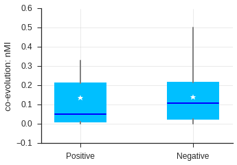

# Analysis of sequence co-evolution on PTM cross-talk

## Load functions and data


```python
import sys
sys.path.append('../')

from scr.utils.coevolution import readFastaEntry, get_align_site, get_msa_site, site_coevolve, get_seq_coEvol
```


```python
import numpy as np
#data_dir = "/Users/huangh/research/PTM/PTM-X_V2.1/"
data_dir = "/afs/inf.ed.ac.uk/user/s13/s1333321/research/PTM-X/"

sample_file = data_dir + "/interface/crosstalkSamples/positive_samples.txt"
samples_positive = np.loadtxt(sample_file, delimiter='\t', skiprows=0, dtype="str")

sample_file = data_dir + "/interface/crosstalkSamples/negative_samples.txt"
samples_negative = np.loadtxt(sample_file, delimiter='\t', skiprows=0, dtype="str")
```


```python
coevol_positive = np.zeros(len(samples_positive))

for i in range(len(coevol_positive)):
    coevol_positive[i] = get_seq_coEvol(samples_positive[i,[0,3]], samples_positive[i,[1,4]], verbose=False, 
                                        data_dir=data_dir)
```


```python
coevol_negative = np.zeros(len(samples_negative))

for i in range(len(coevol_negative)):
    coevol_negative[i] = get_seq_coEvol(samples_negative[i,[0,3]], samples_negative[i,[1,4]], verbose=False, 
                                        data_dir=data_dir)
```


```python
coevol_negative
```


    array([ 0.04437206,  0.08689294,  0.046676  , ...,  0.00595571,
            0.00642855,  0.00775559])


```python

```

### Preference on disordered regions


```python
idx1 = coevol_positive == coevol_positive
print("%.1f%% missing values in %d positive samples." %(100-np.mean(idx1)*100, len(idx1)))

idx2 = coevol_negative == coevol_negative
print("%.1f%% missing values in %d negative samples." %(100-np.mean(idx2)*100, len(idx2)))
```

    30.5% missing values in 95 positive samples.
    32.1% missing values in 6001 negative samples.


```python
from scipy.stats import ks_2samp

x1 = coevol_positive[idx1]
x2 = coevol_negative[idx2]
p_val = ks_2samp(x1, x2)[1]

print("Mean coEvolution nMI score: %.3f (positve) and %.3f (negative), p=%.3f (KS test)." 
      %(np.mean(x1), np.mean(x2), p_val))
```

    Mean coEvolution nMI score: 0.137 (positve) and 0.140 (negative), p=0.115 (KS test).


```python
import seaborn
import pylab as pl
import numpy as np
from hilearn.plot import boxgroup, set_style
%matplotlib inline

set_style()

fig = pl.figure(figsize=(5,3.5))
bp = boxgroup([coevol_positive[idx1], coevol_negative[idx2]], conditions=("Positive","Negative"))
pl.ylabel("co-evolution: nMI")
seaborn.despine()
pl.show()
```





```python

```


```python

```

### Simple test


```python
RV = site_coevolve(np.array(["P04637"]), np.array([387]), np.array([382]), np.array(["T"]), np.array(["K"]),
                   data_dir=data_dir)
print("nMI=%.3f" %RV)

print("\n intra protein")
RV = get_seq_coEvol(["P04637","P04637"], ["T387", "K382"], data_dir=data_dir)
print("nMI=%.3f" %RV)

print("\n inter protein")
RV = get_seq_coEvol(["P12814","Q05397"], ["Y12", "Y397"], data_dir=data_dir)
print("nMI=%.3f" %RV)
```

    nMI=0.566
    
     intra protein
    ['10090' '10116' '10141' '132908' '13616' '13735' '30608' '30611' '31033'
     '37347' '43179' '59463' '61853' '69293' '7897' '7955' '8049' '8083' '8090'
     '8128' '8364' '9305' '9315' '9361' '9371' '9483' '9544' '9593' '9598'
     '9601' '9606' '9615' '9646' '9669' '9685' '9739' '9785' '9796' '9813'
     '9823' '9913' '9986' '99883']
    ['10090' '10116' '10141' '132908' '13616' '13735' '30608' '30611' '31033'
     '37347' '43179' '59463' '61853' '69293' '7897' '7955' '8049' '8083' '8090'
     '8128' '8364' '9305' '9315' '9361' '9371' '9483' '9544' '9593' '9598'
     '9601' '9606' '9615' '9646' '9669' '9685' '9739' '9785' '9796' '9813'
     '9823' '9913' '9986' '99883']
    ['K' 'K' 'R' 'R' 'N' 'E' 'R' 'R' 'G' 'T' 'R' 'R' 'T' '-' 'E' 'D' '-' 'G'
     'E' 'G' 'D' 'S' '-' 'R' 'K' 'R' 'T' 'T' 'T' 'T' 'T' 'R' 'R' 'R' 'R' 'R'
     'R' 'R' 'R' 'R' 'R' 'R' 'G']
    ['K' 'K' 'K' 'K' 'R' 'K' 'K' 'K' 'R' 'K' 'K' 'K' 'K' 'R' 'K' 'K' '-' 'R'
     'A' 'R' 'K' 'R' '-' 'K' 'K' 'K' 'K' 'K' 'K' 'K' 'K' 'K' 'K' 'K' 'K' 'K'
     'K' 'K' 'K' 'K' 'K' 'K' 'R']
    nMI=0.566
    
     inter protein
    ['10020' '10090' '10116' '10141' '132908' '13616' '13735' '28377' '30608'
     '30611' '31033' '37347' '43179' '59463' '59729' '61853' '69293' '7757'
     '7897' '7955' '8049' '8083' '8090' '8128' '8364' '9031' '9258' '9305'
     '9315' '9361' '9371' '9478' '9483' '9544' '9593' '9598' '9606' '9615'
     '9646' '9669' '9685' '9739' '9785' '9796' '9813' '9823' '9913' '9986'
     '99883']
    ['10020' '10090' '10116' '10141' '132908' '13616' '13735' '28377' '30608'
     '30611' '31033' '37347' '43179' '59463' '59729' '61853' '69293' '7757'
     '7897' '7955' '8049' '8083' '8090' '8128' '8364' '9031' '9258' '9305'
     '9315' '9361' '9371' '9478' '9483' '9544' '9593' '9598' '9606' '9615'
     '9646' '9669' '9685' '9739' '9785' '9796' '9813' '9823' '9913' '9986'
     '99883']
    ['Y' 'Y' 'Y' 'Y' 'Y' 'Y' 'Y' '-' 'Y' '-' 'Y' '-' '-' '-' '-' 'Y' 'Y' '-'
     'Y' 'Y' 'Y' '-' 'Y' 'Y' 'Y' 'Y' '-' '-' 'Y' '-' '-' '-' 'Y' 'Y' 'Y' 'Y'
     'Y' 'Y' 'Y' 'Y' 'K' 'Y' 'Y' '-' '-' '-' 'Y' 'Y' 'Y']
    ['Y' 'Y' 'Y' 'Y' 'Y' 'Y' 'Y' 'Y' 'X' 'Y' 'Y' 'Y' 'Y' 'Y' 'Y' 'Y' 'Y' '-'
     'Y' 'Y' 'Y' 'Y' 'Y' 'Y' 'Y' 'Y' 'Y' 'Y' 'X' 'Y' 'Y' 'X' 'Y' 'Y' 'Y' 'Y'
     'Y' 'Y' 'Y' 'Y' 'Y' 'Y' 'Y' 'Y' 'Y' 'Y' 'Y' 'Y' 'Y']
    nMI=0.051


```python

```
